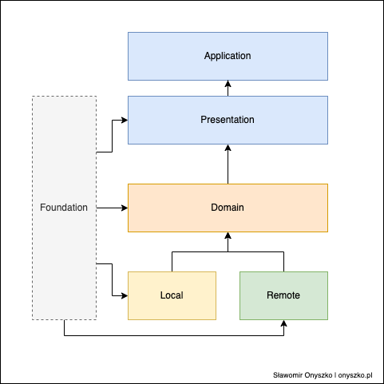

# Welcome to Planik

Project site [planik.pl](https://planik.pl/)

This is my personal playground where I can play with different platforms and technologies.

I wrote the same application in:

- [Android](planik-android/README.md) (InProgress)
- [Flutter](planik-flutter/planik/README.md) (InProgress)
- iOS (Todo)
- .Net 5 (Todo)
- Springboot (Todo)

## Mobile Application Architecture

Architecture contains 4 modules:

- **Presentation** contains everything related to the user-facing parts of our application.
- **Domain** is our access point to external data layers and is used to fetch data from local data
  source but it could be used to fetch data from multiple data sources.
- **Local** handles all communication with the local database which is used to cache data.
- **Foundation** this is horizontal library that is meant for sharing code across all modules if
  possible

